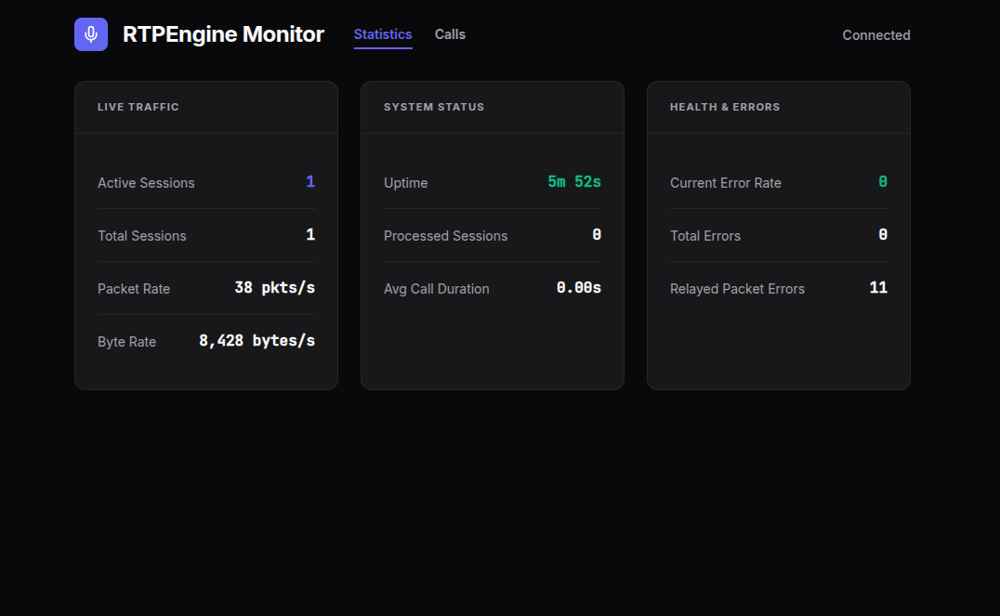
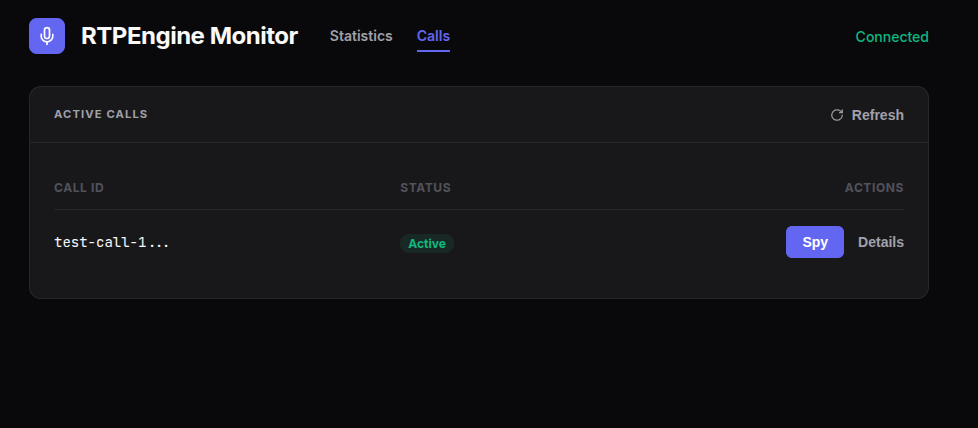
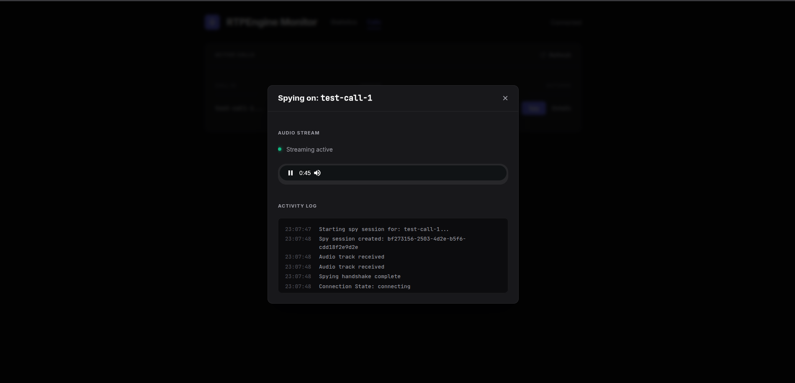
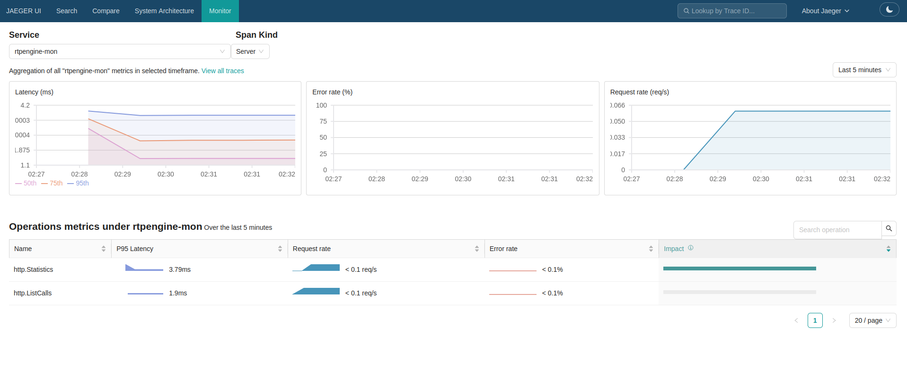

# Rtpengine-Mon

Rtpengine-Mon is a simple tool for monitoring active calls and statistics from **RTPEngine**.

## Features

- **Active Call Monitoring**: View all current calls handled by RTPEngine in real-time.
- **Statistics Dashboard**: View RTPEngine statistics.
- **Audio Spying**: High-quality audio monitoring of calls using WebRTC.
- **Jaeger Monitoring**: Service Performance Monitoring (SPM) using OpenTelemetry for RED metrics (Request, Error, Duration).

## Screenshots










## Getting Started

### Prerequisites

- Go 1.21 or later
- RTPEngine instance

### Configuration

Copy the `.env.example` file to `.env` and configure the necessary variables:

```bash
cp .env.example .env
```

Key configuration options:
- `HTTP_PORT`: Port for the web interface (default: 8081).
- `RTPENGINE_ADDR`: Address of the RTPEngine Control channel.
- `WEBRTC_NAT_1TO1_IPS`: comma separated list of IPs for WebRTC NAT 1to1 mapping.
- `WEBRTC_ICE_ADDRESS`: Public/Local IP address for WebRTC ICE candidates.

### Running the Application

#### Using Go
```bash
go run cmd/rtpengine-mon/main.go
```

### Observability

The project includes a observability stack (Jaeger + Prometheus) to monitor performance. (experimental stuff)

- **Jaeger UI**: [http://localhost:16686](http://localhost:16686) - Access the "Monitor" tab for Service Performance Monitoring (SPM).
- **Prometheus**: Backend for metrics storage.

To start the observability stack:
```bash
docker compose up -d
```
